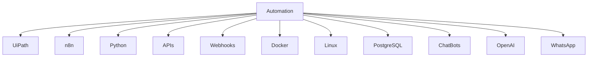

<!--------------------------------------------------------------------------------------------------------------------------------------------------------------------------------->

# 👨‍💻 John Jairo Alvis Carreño

👋 ¡Hola! Soy Ingeniero de Sistemas y automatizador enfocado en crear soluciones inteligentes, eficientes y escalables que optimizan procesos y mejoran la productividad.

💻 Actualmente trabajo con:

- Python Automation
- n8n Workflows
- APIs & Webhooks
- AI Chatbots
- WhatsApp Automation
- Docker & Linux Servers
- PostgreSQL
- Infraestructura VPS
- Automatización empresarial

🚀 Actualmente fortaleciendo conocimientos en:

- UiPath RPA
- Enterprise Automation
- AI Agents
- Workflow Architecture
- Process Automation

🌟 Me apasiona desarrollar automatizaciones modernas orientadas a inteligencia artificial, workflows empresariales e integración de sistemas.

📫 Siempre abierto a colaborar en proyectos relacionados con automatización, IA, chatbots e infraestructura tecnológica.

<!--------------------------------------------------------------------------------------------------------------------------------------------------------------------------------->

## ⚡ Automation Map

<!--------------------------------------------------------------------------------------------------------------------------------------------------------------------------------->

## ⚡ Tech Stack

<!--------------------------------------------------------------------------------------------------------------------------------------------------------------------------------->

## 🚀 Current Focus

🔹 UiPath RPA  
🔹 n8n Automation  
🔹 AI Chatbots  
🔹 Workflow Automation  
🔹 Infrastructure Automation  
🔹 AI Agents  

<!--------------------------------------------------------------------------------------------------------------------------------------------------------------------------------->

 
<b>👁️ Vistas Perfil</b>
  

 

<!--------------------------------------------------------------------------------------------------------------------------------------------------------------------------------->

<!--------------------------------------------------------------------------------------------------------------------------------------------------------------------------------->
