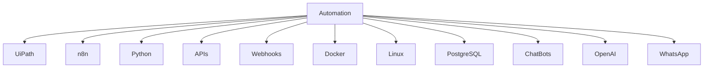

<!--------------------------------------------------------------------------------------------------------------------------------------------------------------------------------->

# 👨‍💻 John Jairo Alvis Carreño

## 🚀 Automation Engineer | RPA Developer | AI Chatbot Developer

👋 ¡Hola! Soy Ingeniero de Sistemas enfocado en automatización de procesos, RPA, chatbots inteligentes y desarrollo de soluciones escalables.

🤖 Actualmente trabajo con automatización utilizando Python, n8n, APIs, workflows inteligentes y tecnologías orientadas a infraestructura y automatización empresarial.

💻 Me especializo en:

- Automatización con Python
- n8n Workflows
- APIs & Webhooks
- AI Chatbots
- WhatsApp Automation
- Docker & Linux Servers
- PostgreSQL
- Infraestructura VPS
- Automatización empresarial

🚀 Actualmente estoy fortaleciendo conocimientos en:

- UiPath RPA
- Enterprise Automation
- AI Agents
- Process Automation
- Workflow Architecture

📫 Siempre estoy abierto a colaborar en proyectos relacionados con automatización, IA, infraestructura y desarrollo de soluciones tecnológicas.

<!--------------------------------------------------------------------------------------------------------------------------------------------------------------------------------->

## ⚡ Tech Map

<!--------------------------------------------------------------------------------------------------------------------------------------------------------------------------------->

## ⚡ Tech Stack

<!--------------------------------------------------------------------------------------------------------------------------------------------------------------------------------->

## 🚀 Current Focus

🔹 UiPath RPA  
🔹 n8n Automation  
🔹 AI Chatbots  
🔹 Workflow Automation  
🔹 Infrastructure Automation  
🔹 AI Agents  

<!--------------------------------------------------------------------------------------------------------------------------------------------------------------------------------->

## 📌 Featured Areas

🤖 AI Chatbots & Conversational Workflows  
⚙️ Business Process Automation  
📡 APIs & Webhook Integrations  
🐳 Docker Infrastructure  
🖥️ VPS & Linux Server Automation  
📊 CRM & Workflow Systems  
📲 WhatsApp Automation  
🧠 AI Agents & Intelligent Systems  

<!--------------------------------------------------------------------------------------------------------------------------------------------------------------------------------->

## 📈 GitHub Stats

<!--------------------------------------------------------------------------------------------------------------------------------------------------------------------------------->

 
<b>👁️ Profile Views</b>
  

 

<!--------------------------------------------------------------------------------------------------------------------------------------------------------------------------------->

